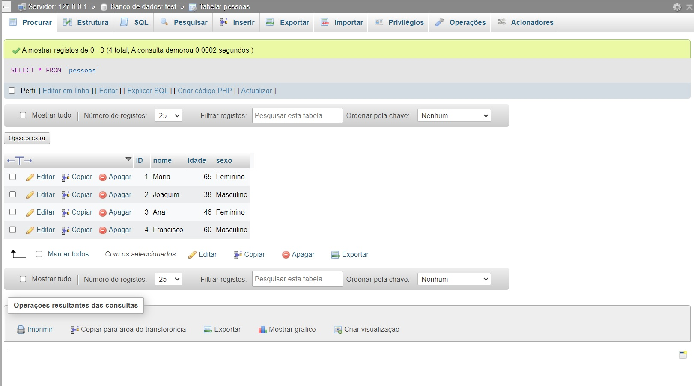

# Conexão com o banco de dados MySQL com Java

🎉 Bem-vindo(a) ao meu projeto em Java que implementa um sistema de gerenciamento de pessoas utilizando um banco de dados MySQL. O projeto permite a inserção, exclusão, alteração e visualização de informações de pessoas no banco de dados.

## Funcionalidades
- [x] Conexão com o banco de dados MySQL;
- [x] Inserir dados;
- [x] Excluir dados;
- [x] Altera dados;
- [x] Visualizar os dados.

## Tecnologia
- Java
- MySQL

# Abaixo segue o Readme criado automaticamente pelo VsCode que auxilia no uso do VsCode.

## Getting Started

Welcome to the VS Code Java world. Here is a guideline to help you get started to write Java code in Visual Studio Code.

## Folder Structure

The workspace contains two folders by default, where:

- `src`: the folder to maintain sources
- `lib`: the folder to maintain dependencies

Meanwhile, the compiled output files will be generated in the `bin` folder by default.

> If you want to customize the folder structure, open `.vscode/settings.json` and update the related settings there.

## Dependency Management

The `JAVA PROJECTS` view allows you to manage your dependencies. More details can be found [here](https://github.com/microsoft/vscode-java-dependency#manage-dependencies).
